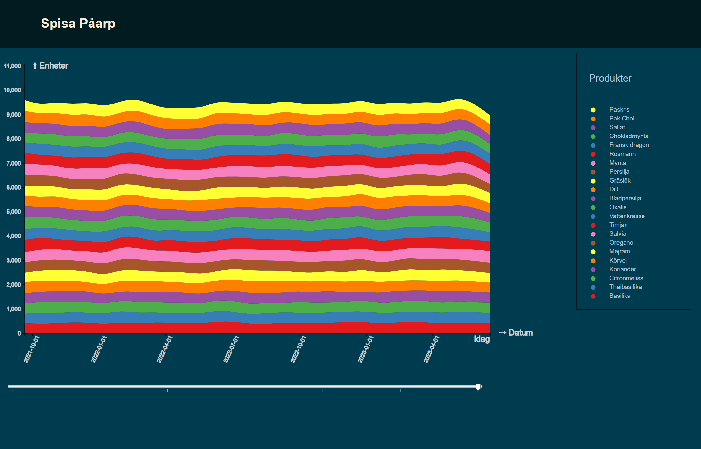
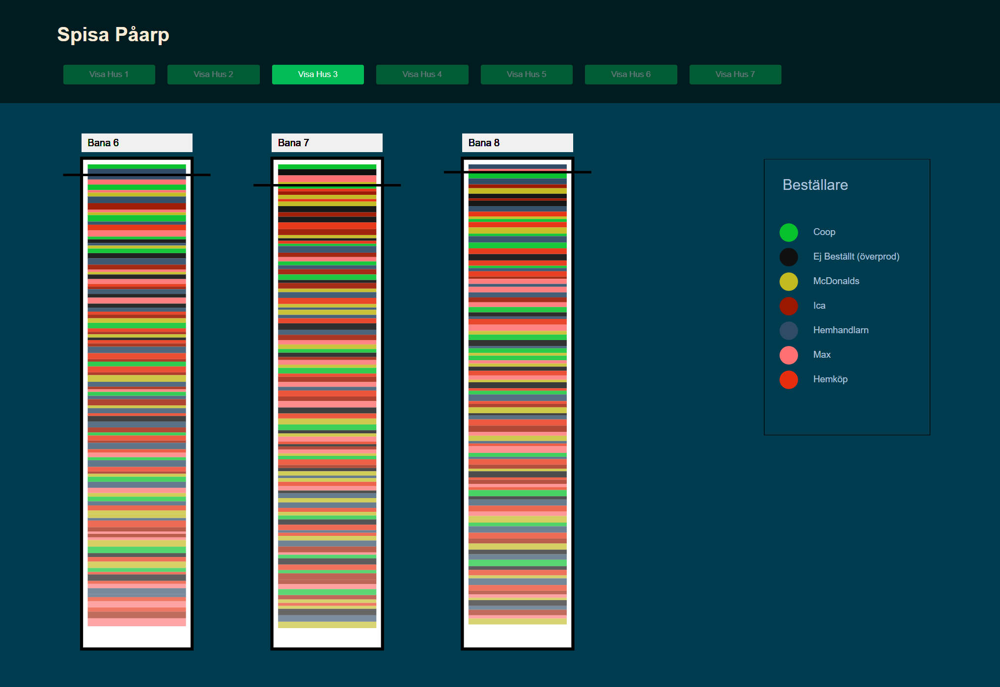

# APIer



Denna vy drivs i dagsläget från en enkel csv-fil med följande headers och data 

```
/data.csv:
________________________________________________________________________________
1    "date","Basilika","Thaibasilika","Citronmeliss","Koriander","Körvel","Mejram",...
2   2023-06-19,16,25,28,16,27,29,14,28,26,26,22,21,12,28,21,24,21,27,22,25,27,10
3   2023-06-18,28,28,27,13,23,15,10,26,26,14,13,12,19,13,13,19,24,26,17,28,14,22
4   2023-06-17,18,21,11,15,19,17,18,27,13,21,16,10,17,24,20,14,23,21,11,18,28,11
5   2023-06-16,22,14,16,28,19,29,21,29,23,18,26,23,20,25,20,13,11,21,13,14,29,29
.....
.....
130 2015-05-13,25,27,27,23,13,24,27,27,28,12,14,27,11,14,16,12,18,13,17,28,25,27
131 2015-05-12,28,12,23,11,17,17,25,28,24,22,19,11,21,21,14,29,28,19,17,27,13,10
132 2015-05-11,23,16,28,21,14,24,11,19,11,11,22,13,14,13,25,20,26,10,17,21,11,15
.......
....
..
.
________________________________________________________________________________
```

Headers sätter date motsvarande leveransdagen, och sedan följer samtliga grödor som Spisa levererar. Varje rad efter det innehåller mängd av respektive gröda som sålts det specifika datumet.
Enklast vore ett end-point API som jag kan slå via exempelvis "addr/historcal.csv" eller "addr/historical.json" och få ut ovan angivna datapunkter.


# Hallarna



Denna vy drivs i dagsläget från två csv-filer med följande headers och data, den första gäller vilka företag som Spisa levererar till:

## Företag
```
/companycolors.csv:
__________________________________________________
1   "company","color"
2   "Ica","#9c1700"
3   "Coop","#08c22d"
4   "Hemköp","#e62e0e"
5   "Hemhandlarn","#2f4c66"
.....
.....
14  "McDonalds","#c2ba1f"
15  "Max","#ff7070"
........
....
..
.
__________________________________________________
```

Samma sak här. Första raden specar företag och färg, följt av varje rad under som specar specifika företag. Färg funkar i #csshex, rgb-värden, HSV, vilket som, så länge de rimligtvis är samma format.

## Beställningar och plats i hall

```
/lanes.csv:
__________________________________________________
1    "lane","company","crop","amount","planted","harvestdate", "qrlink"
2    "0","Coop","Basilika","21","2023-01-01", "id-to-qrcode"
3    "0","Ej Beställt","Basilika","23","2023-01-01","2023-01-25", "id-to-qrcode"
4    "0","McDonalds","Basilika","23","2023-01-01","2023-01-25", "id-to-qrcode"
5    "0","Empty","Empty","40","2023-01-04","2023-01-29", "id-to-qrcode"
........
........
105    "0","Ej Beställt","Basilika","17","2023-02-01","2023-02-25", "id-to-qrcode"
106    "0","Ica","Basilika","18","2023-02-01","2023-02-25", "id-to-qrcode"
107    "0","Coop","Basilika","12","2023-02-01","2023-02-25", "id-to-qrcode"
........
....
..
.
__________________________________________________

```
"Lane" är nollindexerat heltal över vilken bana det planterats i. Om det är enklast att ha 0 till banor-per-hall, och sedan lägga till ett fält för vilken hall det planterats i, spelar mindre roll, annars antar jag 0 till antalet banor totalt på anläggningen.

"Company" refererar till samma companies från companies.csv ovan. Om du väljer att designa det utifrån unika nycklar så jag får companies.csv/json med "company_uuid,company,color", och lanes.csv/json då har "lane,company_uuid,...", spelar mig mindre roll, men, du får välja. Ju färre indirections jag behöver joina i frontend desto trevligare för min del.

 Med "planted" menas "när "sattes de i bana?", och "deliverydate" är just det, när ska det skördas på andra sidan. "Crop" kan sättas till något passande "empty" ifall tomma rännor sätts ut. Jag vill inte få en massa datapunkter på grödor som fortfarande står i ledkammare, och inte heller redan skördade rännor. 

 Fältet "id-to-qrcode" är antingen en url eller id som kan användas för att konstruera en korrekt url att hämta bild på qr-koden med.

